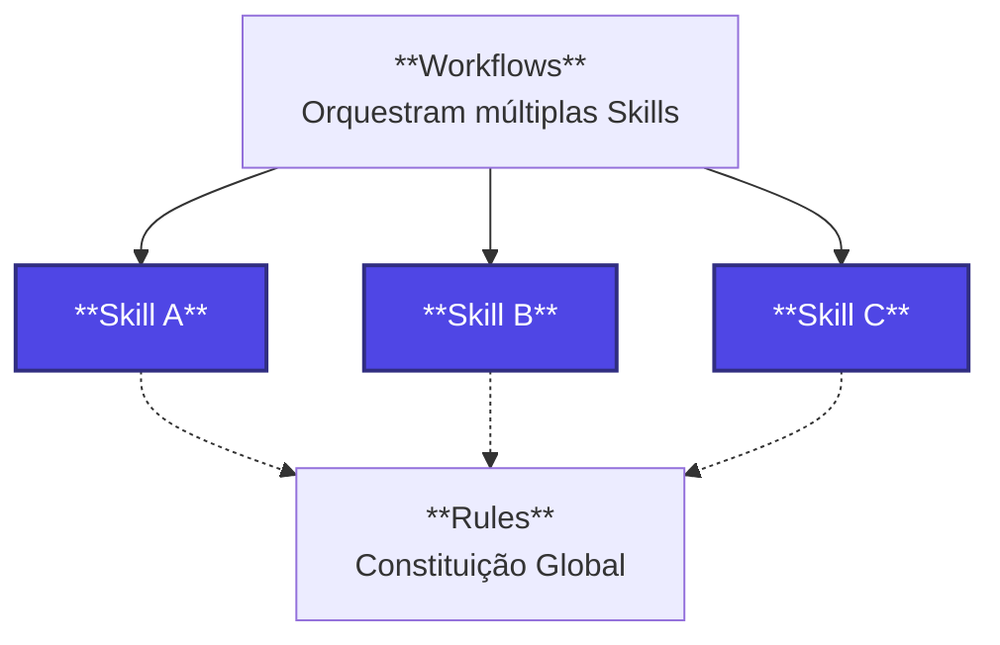

# 🎯 Skills (Habilidades)

> **O Bloco de Lego da Automação Científica**

Bem-vindo ao diretório `/skills` do repositório. Na **Pirâmide da Automação**, as *Skills* ocupam o nível intermediário: são receitas de execução modulares, focadas em resolver **um problema científico específico** de forma consistente e reprodutível.



---

## 🧠 O que é uma Skill?

Uma **Skill** é um manual de instruções estático em formato Markdown. Ela não contém código executável em si, mas descreve exatamente **o que**, **como** e **sob quais restrições** um agente de IA (como a Antigravity IDE) deve agir para realizar uma tarefa técnica específica.

### ⚖️ Diferença na Pirâmide da Automação

| Nível | Conceito | Escopo | Exemplo Prático |
| :--- | :--- | :--- | :--- |
| **Rules** | Constituição Global | Todo o repositório / Sempre ativo | *"Sempre comente o código e documente bibliotecas do R."* |
| **Skills** | **Receita Modular** | **Uma tarefa específica e isolada** | **`bovine-variant-annotator` (Anotação de variantes bovinas contra o Ensembl).** |
| **Workflows** | O Maestro/Orquestrador | Coordenação de ponta a ponta | *Pipeline completo: Baixar VCF $\rightarrow$ Filtrar $\rightarrow$ Chamar Skill de Anotação.* |

---

## 🧬 Anatomia de uma Skill Robusta

Para criar uma Skill útil em Bioinformática e evitar **alucinações** (um risco real ao lidar com sequências genômicas e identificadores biológicos), cada Skill deve seguir uma estrutura bem definida em seu respectivo arquivo `SKILL.md`.

### Estrutura Recomendada (`SKILL.md`)

```markdown
# Nome da Skill (ex: Bovine Variant Annotator)

Uma descrição breve de 1-2 frases sobre o que esta Skill faz e qual o seu objetivo biológico.

## 🛠️ Pré-requisitos & Ambiente
- **Linguagem:** R >= 4.3 ou Python >= 3.10
- **Bibliotecas Necessárias:** (ex: `biomaRt`, `VariantAnnotation`, `dplyr`)
- **Arquivos/Bancos de Entrada:** Formato esperado e onde obtê-los.

## 📋 Instruções de Execução (Workflows & Passos)
1. **Entrada de Dados:** Descreva como ler o arquivo de entrada com segurança.
2. **Processamento:** O passo a passo exato do algoritmo ou chamadas de API.
3. **Tratamento de ID:** Como mapear IDs (ex: converter Ensembl Gene ID para Gene Symbol) sem perder dados.

## ⚠️ Restrições e Segurança (Anti-Alucinação)
- **NUNCA** invente sequências FASTA. Se não encontrar, retorne `NA`.
- **NUNCA** force o mapeamento de genes usando heurísticas textuais perigosas. Use fontes oficiais.
- Sempre verifique a versão do genoma de referência (ex: ARS-UCD1.2 para *Bos taurus*).

## 📊 Formato de Saída Esperado
- Estrutura exata do arquivo final (colunas, tipos de dados).
- Exemplo de output desejado.
```

---

## 📂 Nossas Skills de Referência

Conforme avançamos nos workshops, este diretório será povoado com referências oficiais criadas em aula. Você poderá utilizá-las diretamente na Antigravity IDE ou como base para criar suas próprias skills de projeto.

| Skill | Workshop | Descrição | Status |
| :--- | :--- | :--- | :--- |
| `bovine-variant-annotator/` | WS2 | Anotação funcional de variantes em *Bos taurus* usando APIs e pacotes de R | ⏳ Planejado (WS2) |
| `eqtl-analysis/` | WS3 | Pipeline automatizado e reprodutível de análise de associação de eQTL | ⏳ Planejado (WS3) |

---

## 🚀 Como a IA Usa as Suas Skills?

A **Antigravity IDE** lê de forma inteligente os arquivos dentro desta pasta. Quando você faz uma solicitação e o agente percebe que ela se encaixa no escopo de uma Skill ativa:
1. O agente carrega o arquivo `SKILL.md` como contexto prioritário.
2. O comportamento da IA é moldado pelas instruções e restrições descritas na Skill.
3. O código é gerado de forma extremamente precisa e alinhada às melhores práticas científicas do seu laboratório.

> **💡 Dica de Ouro:** Quanto mais específica e rica em exemplos for sua Skill, menor será a taxa de erro da IA nas suas análises genômicas!
